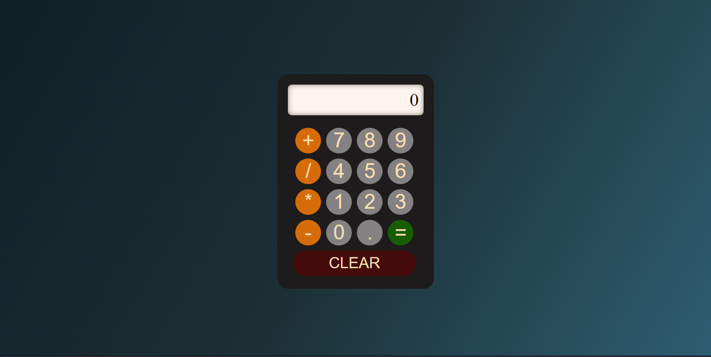

# Simple Calculator 

A simple web-based calculator built using **HTML**, **CSS**, and **JavaScript**. This calculator supports basic arithmetic operations, including addition, subtraction, multiplication, and division.

---

## 🚀 Features

- **User-friendly interface**: Clean and intuitive buttons for digits, operators, and the clear screen.
- **Real-time display**: Instant feedback as you input numbers and perform calculations.
- **Basic arithmetic functionality**: Add, subtract, multiply, and divide with ease.
- **Responsive design**: Seamlessly adapts to various screen sizes, from mobile to desktop.

---

## 🛠 Technologies Used

- **HTML**: To create the structure of the calculator.
- **CSS**: For styling and making the interface look modern and sharp.
- **JavaScript**: Powers the calculation logic for smooth operation.

---

## 📱 How It Works

1. **Enter numbers and operators** by clicking the buttons.
2. **Press `=`** to get the result of your calculation.
3. **Hit `CLEAR`** to reset the screen and start fresh.

---

## 🖥️ Demo

Test the calculator and see it in action by following the steps above. It's fun, functional, and easy to use!

---

## ✨ Contributing

Want to improve or add new features? Feel free to **fork** the repository and submit a **pull request**!

---

## 📄 License

This project is open-source and licensed under the **MIT License**.

---

## 👨‍💻 Author

[Pravin J](https://github.com/jpravin664)
